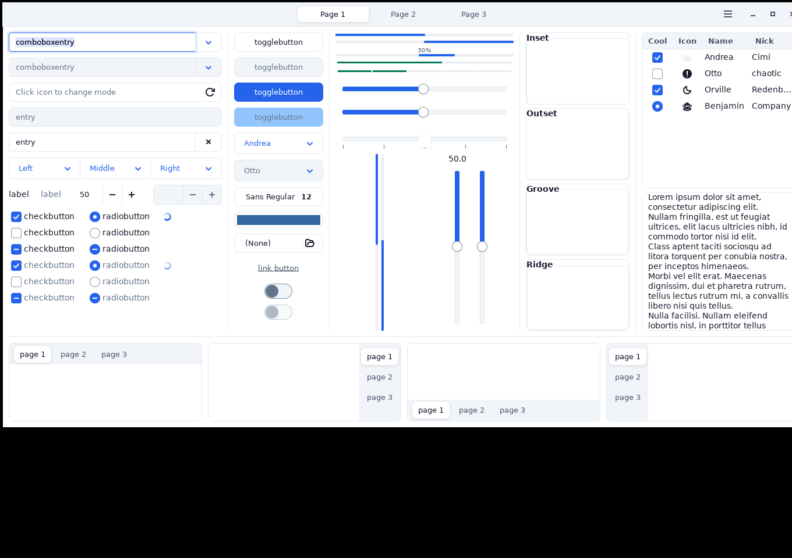
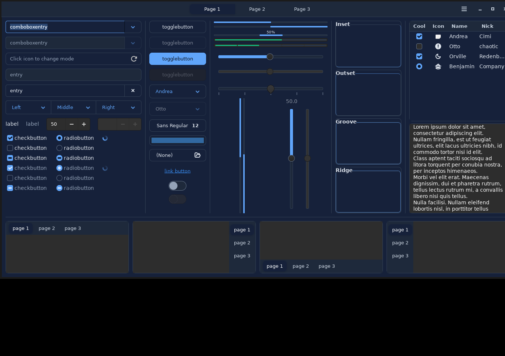

# Halon

A desktop theme in slate and a single blue, ported across a dozen applications from one set of
colour tokens.

Halon is a specification first and a collection of stylesheets second.
[THEME-DESIGN-GUIDE.md](THEME-DESIGN-GUIDE.md) defines the whole thing — the token set, the
palette, the type and spacing scale, the component treatments, and a dark mode built by
re-declaring thirty-one values. Every port in this repository implements that one document, and
every generated stylesheet is built from the same token files, so a colour is decided once and
nowhere else.

| | |
| --- | --- |
|  |  |

## The idea

- **One accent, one hue family.** Slate plus one blue. Status colours carry meaning, never
  decoration.
- **Flat surfaces, hairline separation.** Structure comes from 1px borders and a three-step surface
  scale. Shadows appear only where something genuinely floats.
- **The frame is recessed, the content is raised.** Panels, toolbars, tab strips and sidebars sit
  one step back from the content surface in both schemes, and the selected item in them is a raised
  card rather than a block of accent colour.
- **Everything routes through the token set.** No component rule contains a literal colour, with no
  exceptions.
- **Contrast is a property of the palette.** Every foreground/background pair the theme sanctions
  meets WCAG 2.1 AA in both schemes, and `halon-audit` checks that it still does.

## Ports

| Target | Where | Notes |
| --- | --- | --- |
| GTK 3, GTK 4 / libadwaita | [gtk/](gtk/) | the reference implementation; hand-written |
| Cinnamon shell | [cinnamon/](cinnamon/), [gtk/Halon/cinnamon/](gtk/Halon/cinnamon/) | generated |
| Qt 5, Qt 6 | [qt/](qt/) | colour scheme plus a Fusion stylesheet; generated |
| Icons | [icons/](icons/) | a [Colloid](https://github.com/vinceliuice/Colloid-icon-theme) overlay |
| Firefox | [firefox/](firefox/) | static theme, plus a `userChrome.css`; generated |
| VS Code | [vscode/](vscode/) | `Halon Light` and `Halon Dark`; generated |
| Steam | [steam/](steam/) | a [Millennium](https://steambrew.app) theme; generated |
| Trilium Notes | [trilium/](trilium/) | a CSS note on its `next` base; generated |
| Tilix | [tilix/](tilix/) | the sixteen-slot terminal palette |
| LMMS | [lmms/](lmms/) | both schemes; generated |
| LightDM | [lightdm/](lightdm/) | a [web-greeter](https://github.com/JezerM/web-greeter) login screen |
| Plymouth | [plymouth/](plymouth/) | a boot splash on the dark scheme |

Each port's own README says what is generated and how to regenerate it. The short version: edit the
tokens in `gtk/Halon/shared/` or the mapping in the port's build script under
[scripts/](scripts/) — never the generated file.

[theme-demo.html](theme-demo.html) is a self-contained page showing every component the guide
specifies, in both schemes. Open it in a browser; it is also what the audit measures heights
against.

## Installing

Halon is packaged as a Nix flake. For NixOS:

```nix
{
  inputs.halon.url = "github:BeatLink/Halon";

  # in your configuration
  imports = [ halon.nixosModules.default ];
  themes.halon.enable = true;
}
```

For home-manager, which also selects Halon for GTK, the Cinnamon shell and icons:

```nix
imports = [ halon.homeManagerModules.default ];
themes.halon.enable = true;
themes.halon.qt = true;          # optional; also needs qt.platformTheme set to qt5ct/qt6ct
```

Individual ports are separate packages — `halon-theme`, `halon-icon-theme`, `halon-qt-theme`,
`halon-vscode-theme`, `halon-firefox-theme`, `halon-steam-theme`, `halon-trilium-theme`,
`halon-tilix-theme`, `halon-lmms-theme`, `halon-lightdm-theme`, `halon-plymouth-theme` — so a
single target can be installed on its own:

```sh
nix profile install github:BeatLink/Halon#halon-vscode-theme
```

`halon-tokens` installs [tokens.json](tokens.json): both schemes' colours, resolved to hex. The
flake also exposes it as `halon.tokens`, so a consumer theming something Halon has no stylesheet
for can read the palette instead of transcribing it.

Without Nix, the ports are plain files; follow the install section in the port's README.

## Working on it

```sh
nix develop          # or `direnv allow`, which does the same
```

The shell brings GTK 3, GTK 4, libadwaita and the verification tools, and prints the commands it
provides:

```
halon-build [--check]   regenerate the derived stylesheets from the tokens
halon-lint              undefined tokens, stray literals, import order
halon-audit [--render]  contrast and drift audit over both schemes
halon-shots [outdir]    render the GTK theme in Xvfb and screenshot it

preview-gtk3 [dark]     GTK 3 widget factory — every widget, every state
demo-gtk3    [dark]     GTK 3 demo — real windows, sidebars, dialogs
demo-adwaita [dark]     libadwaita demo — the GTK 4 named-colour path
icons-gtk3   [dark]     GTK 3 icon browser
preview-lightdm         the greeter in a browser, against its mock
preview-lmms            LMMS against the working tree's stylesheet
```

Each is also a flake app, so `nix run .#audit` works without entering the shell.

A change to a colour means editing `gtk/Halon/shared/_tokens-light.css` or `_tokens-dark.css`, then
running `halon-build` to regenerate everything derived from them and `halon-audit` to confirm the
contrast guarantees still hold. `halon-build --check` and `halon-audit` both fail loudly on stale
output.

The installed theme is what the desktop reads, so seeing a repo edit in the live session means
rebuilding and switching, not reloading.

Screenshots in [screenshots/](screenshots/) are regenerated by `halon-shots`, except the Cinnamon
shell captures, which cannot be rendered headless and are cropped from a live session.

Ports version independently. A `firefox-v*` tag publishes the Firefox theme to addons.mozilla.org
via [.github/workflows/firefox-release.yml](.github/workflows/firefox-release.yml), which refuses to
sign a build whose manifest no longer matches its tokens.

## Licence

GPL-3.0. See [LICENSE](LICENSE).
